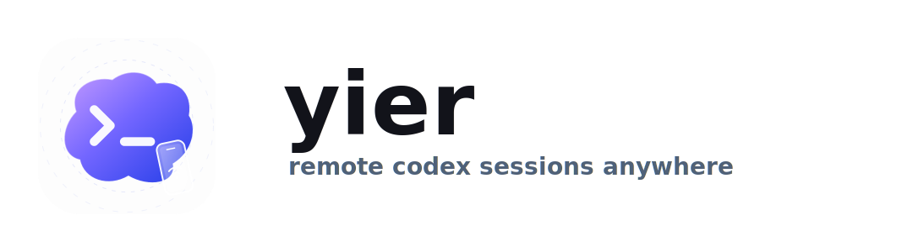

<p align="center">
  
</p>

# yier

Remote-friendly Codex web workspace for continuing sessions from desktop and mobile browsers.

## Resume
[一二Resume](https://baike.baidu.com/item/%E4%B8%80%E4%BA%8C/23434669)

## Requirements

- Python 3.12+
- `uv`
- Node.js 20+
- `pnpm`

## Install

Backend dependencies:

```bash
uv sync
```

Codex workspace support uses the published `codex-ipc` package from PyPI.

Frontend dependencies:

```bash
cd web
pnpm install
```

## Authentication

This app now supports password protection for deployed environments.

Enable auth with either:

- `YIER_AUTH_PASSWORD`
- `YIER_AUTH_PASSWORD_HASH`

Plain password example:

```bash
export YIER_AUTH_PASSWORD='change-this-password'
```

Hashed password example:

```bash
uv run python -c "from yier_web.auth import hash_password; print(hash_password('change-this-password'))"
export YIER_AUTH_PASSWORD_HASH='paste-generated-hash-here'
```

Optional auth settings:

- `YIER_AUTH_SECRET`: optional extra signing secret for session cookies
- `YIER_AUTH_SESSION_TTL_HOURS`: cookie lifetime in hours, default is `168`
- `YIER_CODEX_EMBED_TOKEN`: token for unauthenticated Codex iframe access

If neither password variable is set, authentication is disabled.

## Codex Iframe Embed

Yier exposes a chat-only Codex iframe at `/codex/embed`. The iframe does not
show the Codex session list or the main app navigation.

Set an embed token on the Yier server:

```bash
export YIER_CODEX_EMBED_TOKEN='change-this-embed-token'
```

Embed the chat frame with only the token in the URL:

```html
<iframe
  id="codex-frame"
  src="http://127.0.0.1:9999/codex/embed?embed_token=change-this-embed-token"
  style="width: 100%; height: 720px; border: 0"
></iframe>
```

All operational parameters are sent with `postMessage`; the iframe URL only carries
`embed_token`. Start a thread, set plan mode, create a goal, and send an initial prompt:

```js
const frame = document.querySelector('#codex-frame')

frame.contentWindow.postMessage(
  {
    type: 'yier:codex-start',
    cwd: '/Users/me/project',
    mode: 'plan',
    goal: {
      objective: 'Finish the migration',
      tokenBudget: 12000,
    },
    prompt: 'Inspect this project',
  },
  'http://127.0.0.1:9999',
)
```

Resume an existing Codex thread:

```js
frame.contentWindow.postMessage(
  {
    type: 'yier:codex-resume',
    threadId: 'thread-id-here',
    mode: 'plan',
  },
  'http://127.0.0.1:9999',
)
```

`mode`, `goal`, and `prompt` are optional on both start and resume. The iframe
selects the thread, applies mode and goal, then sends the prompt. `cwd` is resolved
by the backend as the Codex working directory. Optional `commandId` values are
echoed in `yier:codex-command-result` responses.

The parent can also send these commands after a thread is active:

- `yier:codex-send-prompt`: `prompt` plus optional model, reasoning, attachment,
  and permission fields
- `yier:codex-steer-prompt`: `prompt`
- `yier:codex-enqueue-followup`: `prompt`
- `yier:codex-remove-followup`: `messageId`
- `yier:codex-interrupt-turn`
- `yier:codex-compact-thread`
- `yier:codex-set-mode`: `mode` (`build` or `plan`)
- `yier:codex-set-goal`: `objective`, optional `tokenBudget`
- `yier:codex-update-goal-status`: `status`
- `yier:codex-clear-goal`
- `yier:codex-submit-user-input`: `requestId`, `response`
- `yier:codex-rename-thread`: `name`
- `yier:codex-archive-thread`
- `yier:codex-fork-thread`

If authentication is enabled, the iframe page is public, but the Codex WebSocket
still requires a valid `embed_token` unless the browser already has an
authenticated Yier session.

The iframe posts lifecycle messages to its parent window:

```js
window.addEventListener('message', (event) => {
  if (event.data?.type === 'yier:codex-ready') {
    console.log('Codex iframe is ready')
  }
  if (event.data?.type === 'yier:codex-thread-created') {
    console.log(event.data.threadId, event.data.cwd, event.data.mode)
  }
  if (event.data?.type === 'yier:codex-thread-resumed') {
    console.log(event.data.threadId, event.data.cwd, event.data.mode)
  }
  if (event.data?.type === 'yier:codex-prompt-sent') {
    console.log(event.data.threadId, event.data.cwd, event.data.mode)
  }
  if (event.data?.type === 'yier:codex-command-result') {
    console.log(event.data.commandId, event.data.command, event.data.ok)
  }
  if (event.data?.type === 'yier:codex-turn-state') {
    console.log(event.data.threadId, event.data.turn)
  }
  if (event.data?.type === 'yier:codex-goal-state') {
    console.log(event.data.threadId, event.data.goal, event.data.completedGoal)
  }
  if (event.data?.type === 'yier:codex-mode-changed') {
    console.log(event.data.threadId, event.data.mode)
  }
  if (event.data?.type === 'yier:codex-user-input-request') {
    console.log(event.data.threadId, event.data.request)
  }
  if (event.data?.type === 'yier:codex-error') {
    console.error(event.data.message)
  }
})
```

The iframe also emits the compatibility event `yier:codex-status` and the queue
event `yier:codex-followups-changed`. Goal completion is reported by
`yier:codex-goal-state`; turn completion is reported independently by
`yier:codex-turn-state`.

## Development Startup

Development mode is different from production:

- The backend should run with `--debug`
- The frontend should run with Vite dev server
- In this mode, the backend proxies frontend requests to `http://127.0.0.1:5173`

Recommended one-command startup:

```bash
uv run yier-dev
```

This starts:

- frontend: `pnpm dev`
- backend: debug mode with reload

If you prefer split terminals:

Frontend only:

```bash
uv run yier-dev-web
```

Backend only:

```bash
uv run yier-dev-backend
```

You can also override backend bind settings:

```bash
uv run yier-dev --host 127.0.0.1 --port 9999
uv run yier-dev-backend --host 127.0.0.1 --port 9999
```

Default address:

- App: `http://127.0.0.1:9999`
- Vite dev server: `http://127.0.0.1:5173`

Notes:

- Keep `pnpm dev` running, otherwise the backend cannot proxy the frontend in debug mode.
- API requests still go through the Python server at port `9999`.

## Production Startup

Production mode does not use the Vite dev server.

You must build the frontend first:

```bash
uv run yier-build-web
```

Then start the backend without `--debug`:

```bash
uv run yier-prod
```

In production mode:

- The backend serves `web/dist`
- No Vite proxy is used
- Authentication should usually be enabled with `YIER_AUTH_PASSWORD` or `YIER_AUTH_PASSWORD_HASH`

Production example:

```bash
export YIER_AUTH_PASSWORD='change-this-password'
uv run yier-build-web
uv run yier-prod --host 0.0.0.0 --port 9999
```

## Common Commands

Backend tests:

```bash
uv run pytest
```

Targeted backend tests:

```bash
uv run pytest tests/test_codex_backend.py tests/test_codex_workspace.py tests/test_app.py
```

Backend compile check:

```bash
uv run python -m compileall yier_web
```

Frontend unit tests:

```bash
cd web
pnpm test:unit
```

Frontend type check:

```bash
cd web
pnpm type-check
```

Frontend production build:

```bash
uv run yier-build-web
```

## Startup Summary

Development:

```bash
uv run yier-dev
```

Production:

```bash
export YIER_AUTH_PASSWORD='change-this-password'
uv run yier-build-web
uv run yier-prod --host 0.0.0.0 --port 9999
```

## Available uv Scripts

Development:

- `uv run yier-dev`: start frontend and backend together
- `uv run yier-dev-web`: start Vite only
- `uv run yier-dev-backend`: start backend only in debug mode

Production:

- `uv run yier-build-web`: build frontend assets
- `uv run yier-prod`: start backend in production mode
```
